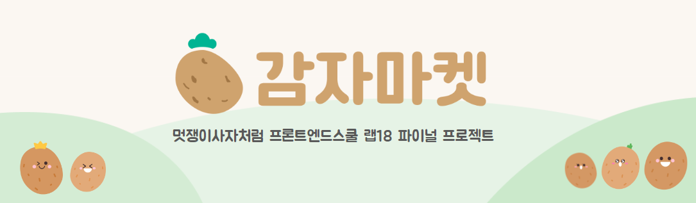
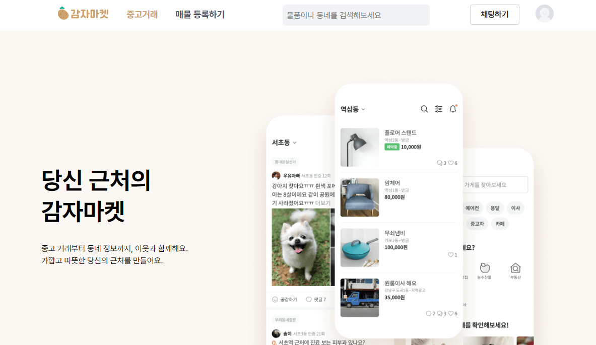
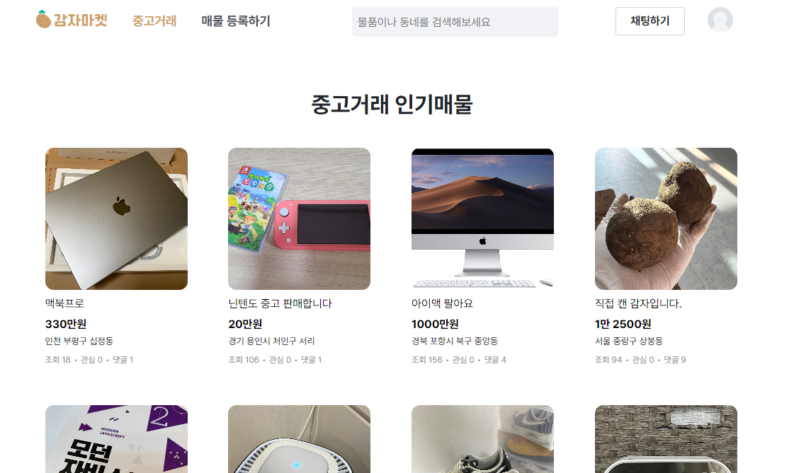
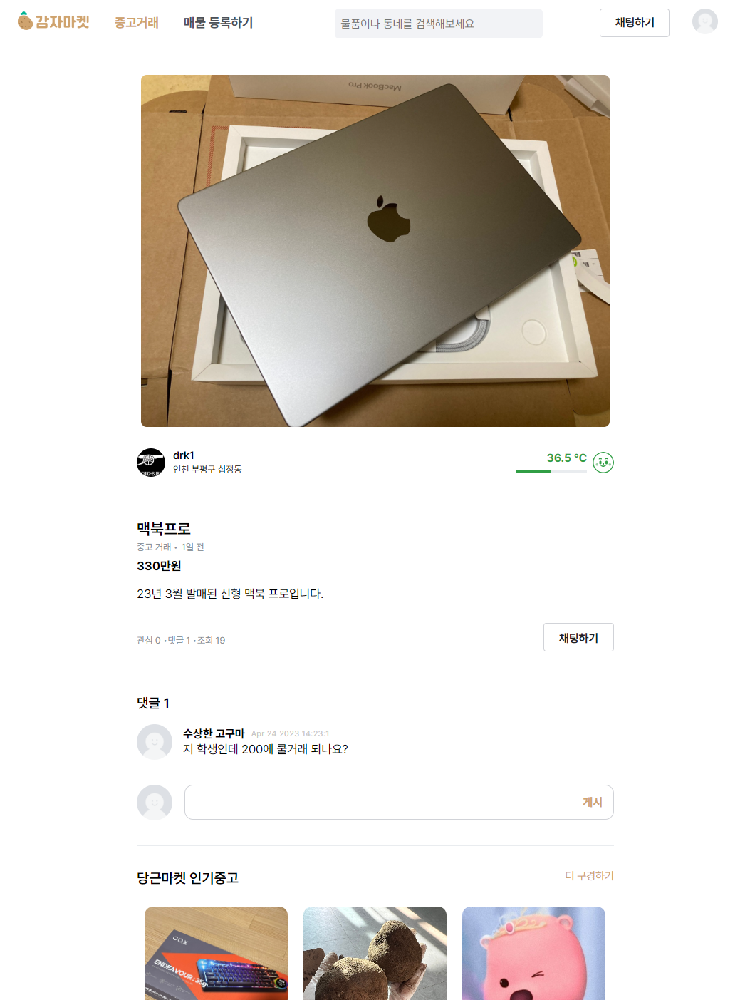
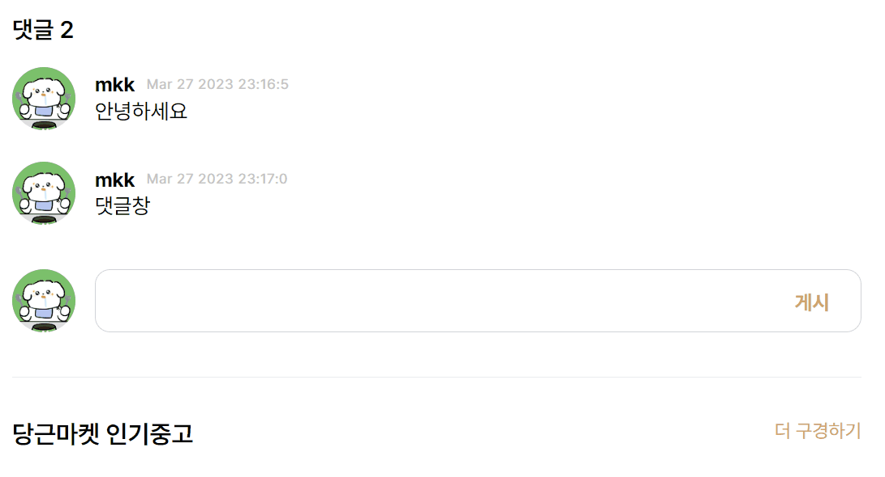
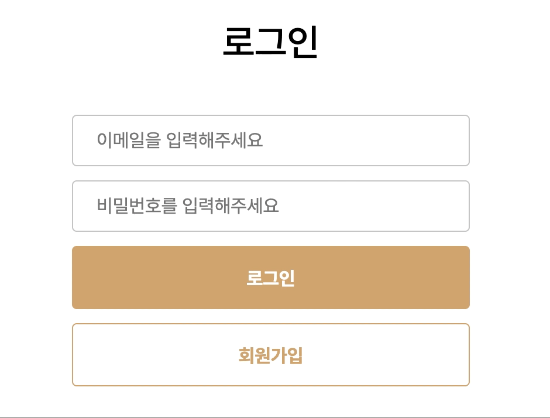
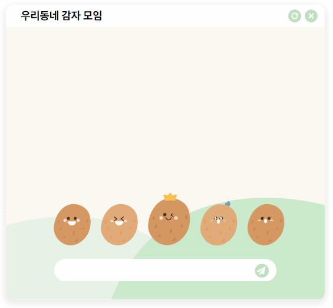
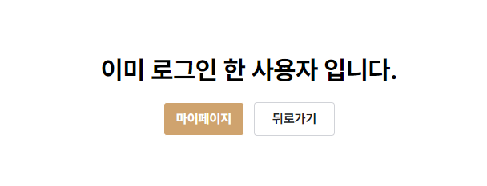
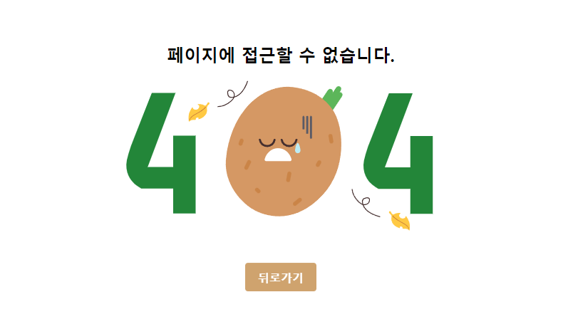

# 어서오세요, 감자마켓 🥔

  <br>

<br>

<!--  -->

## 📑 프로젝트 개요

### 프로젝트 기획 의도

**감자마켓**은 [당근마켓](https://www.daangn.com/)을 토대로 만든 쇼핑몰 웹 페이지입니다.

모바일 어플리케이션 기반인 당근마켓은 웹 페이지가 가져야될 주요 기능들도 앱과 연동하여 사용하는 경우가 많았고, 웹 페이지 내에서는 매물을 보거나 사진을 확인할 수 있지만 거래를 진행하는 실질적 기능들은 지원이 되지 않았습니다. 대체적으로 당근 마켓이 웹에서는 사용자와의 상호 작용 보다는 앱 사용을 유도하는 온라인 쇼룸이라는 인상을 받았습니다.

당근마켓을 보완한 감자마켓은 한정적인 정보를 제공하던 **포괄적인 정보를 제공하는 방향성을 고민하여 웹에서의 서비스만으로도 거래를 진행할 수 있도록 새롭게 제품을 재구성하여 개발하였습니다.**
<br>

### 팀 목표

- 혼자서 많은 기능을 구현하기보다, 함께 검토하면서 좋은 코드로 확실한 하나의 기능을 개발하는 것을 추구. 이를 위해 **페어프로그래밍** 으로 프로젝트 진행
- 제품으로서 가치를 전달할 수 있는 핵심 기능위주로 구현하기
- 갈등 상황에서는 감정보다는 논리적 근거를 통해 논쟁하고, 해결하는 것이 목표

### 프로젝트 기간

- 구현: 23.03.13 ~ 23.03.29
- 리팩토링: 23.04.17 ~ 23.04.21

### [프로젝트 발표 자료](https://docs.google.com/presentation/d/1-NoVMkBrdMonBgcdk9808pR6g228xTydlKt7xHja9qY/edit#slide=id.p)

<br>

## 🏠 [배포 페이지](https://potato-market-lab18.web.app/)

> [https://potato-market-lab18.web.app/](https://potato-market-lab18.web.app/)

<br>

## ⚔ 사용된 기술

      
<br>

<br>

## 🎨 주요 기능 소개

### ▶️ [홈 ("/")](https://potato-market-lab18.web.app/)

 <br>

### ▶️ [인기매물 ("/HotArticles")](https://potato-market-lab18.web.app/hotArticles)

- Firebase - firestore : 게시글 작성 완료시 firestore 의 닉네임, 프로필사진, 주소, 조회수, 관심순, 댓글수 데이터를 받아 중고 매물 리스트 페이지에 작성된 날짜 순으로 렌더링

 <br>

### ▶️ [제품 상세 ("/productDetail")](https://potato-market-lab18.web.app/detailarticle/IwxaAzpUhdXKz27bGjLd)

- `useParams()` 사용해 uid와 게시글 데이터를 받아와 렌더링
- `UpdateDoc` 사용해서 조회수 기능, 댓글 기능 구현
- 게시글 작성자의 uid 와 로그인된 uid 가 일치하면 게시글 수정/삭제 버튼 노출
- 게시글 수정/삭제 기능은 `UpdateDoc`/`DeleteDoc` 으로 구현

 <br>
 <br>

### ▶️ [게시글 작성 ("/WriteArticles")](https://potato-market-lab18.web.app/writeArticle)

- 다수의 이미지 파일 업로드 및 프리뷰 기능
- Firebase - storage : 게시글 작성시 이미지 파일을 storage 에 저장. 업로드한 이미지는 browser-image-compression 라이브러리를 통해 압축하여 Storage에 저장됨
- Firebase - firestore : 사용자의 uid, 닉네임, 주소, 제목 및 본문 데이터를 받아 firestore에 저장

 <br>

### ▶️ [로그인 ("/SignIn")](https://potato-market-lab18.web.app/signin)

- 로그인 시도 시, Firebase - Authentication 에 저장된 계정을 대조해서 확인
- 일치하는 계정이 없을 경우 경고 팝업 노출
- 로그인 완료되면 해당 유저의 UID를 인식한 뒤, 동일한 UID로 이름 지어진 user 컬렉션의 문서를 찾아 회원 정보를 가져옴. 가져온 회원 정보는 recoil로 관리 중인 상태에 담아 이용

 <br>

### ▶️ [회원가입 ("/SignUp")]()

- Firebase - Authentication : 회원가입 시도 시, 이메일/비밀번호를 기반으로 새 계정 생성
- 다음 조건에 따라 회원가입 유효성 검사 진행
  - 비밀번호 : 6-8자 입력 문구 노출
  - 비밀번호 확인 : 비밀번호 일치 여부 확인 문구 노출
  - 닉네임 : 제출 시 중복 닉네임 검사
  - 이용약관 : 필수 약관 클릭 검사
- 사용자 동네 설정을 위해 다음 주소 API를 이용해서 시/구/동 정도 저장
- Firebase - stroage : 사용자의 프로필 사진을 최적화 한 뒤, 파이어베이스에 저장
- Firebase - firestore : users 컬렉션에 새 계정의 UID로 이름지어진 신규 문서 생성 후 회원 정보 저장

 <br>

### ▶️ [마이페이지 ("/myPage")](https://potato-market-lab18.web.app/myPage)

- 로그인과 동시에 recoil에 저장된 사용자의 정보와 사용자가 게시한 매물 정도를 나열
- Firestore의 updateDoc과 Storage를 이용한 회원 정보 수정. Authentication의 delete를 이용한 회원 탈퇴 기능 제공

 <br>

### ▶️ 채팅

- Firebase를 이용해 로그인된 사용자의 uid 를 받아 업데이트
- onSnapShot, updateDoc 을 이용해서 firestore database 변화 있을 시 자동 렌더링되도록 구현

 <br>

### ▶️ 기타 페이지 알림


 <br>
 <br>

## 👑 [성능 개선 작업](https://velog.io/@drk/React-%ED%94%84%EB%A1%9C%EC%A0%9D%ED%8A%B8-%EC%84%B1%EB%8A%A5%EA%B0%9C%EC%84%A0-Cleanup-function)

중고 매물 거래 플랫폼의 특성 상 고화질의 이미지를 업로드하고 불러오다보니 이미지로 인한 성능 저하가 눈에 띄게 보였습니다.

또한 불필요한 조건부 렌더링으로 인해 CLS 점수가 매우 낮게 나왔고, 이를 개선하는 작업을 진행하였습니다.

 <br>
 <br>

### ▶️ [이미지 최적화](https://velog.io/@dksyu_0618/%EA%B0%90%EC%9E%90%EB%A7%88%EC%BC%93-%EC%84%B1%EB%8A%A5%EA%B0%9C%EC%84%A0%EC%9D%B4%EB%AF%B8%EC%A7%80-%EC%B5%9C%EC%A0%81%ED%99%94)

vite 에는 이미지 최적화 기능을 포함하고 있지 않기 때문에 별도의 최적화 작업이 필요했습니다.

다음과 같은 플러그인을 설치하여 이미지 최적화 작업을 진행하였습니다.

```jsx
"devDependencies": {
  "@vheemstra/vite-plugin-imagemin": "1.0.8",
  "imagemin-mozjpeg": "10.0.0",
  "imagemin-webp": "8.0.0",
  "imagemin-gifsicle": "7.0.0",
  "imagemin-pngquant": "9.0.2",
  "imagemin-svgo": "10.0.1",
}
```

- vite-plugin-imagemin : 이미지 최적화를 위한 각 하위 라이브러리를 사용하도록 설정하는 플러그인
- imagemin-\* : 각 이미지 형식에 따른 이미지 압축 플러그인

다음으로는 makeWebp 옵션에서 imageminWebp()를 사용하여 jpg, png 로 업로드된 이미지들을 WebP 형식으로 변환해주었습니다.

```jsx
// vite.config.js
plugins: [
    react(),
    viteImagemin({
      plugins: {
        jpg: imageminMozjpeg(),
        png: imageminPngQuant(),
        gif: imageminGifSicle(),
        svg: imageminSvgo(),
      },
      makeWebp: {
        plugins: {
          jpg: imageminWebp(),
          png: imageminWebp(),
        },
      },
    }),
  ],
```

<br>

### ▶️ [코드 스플리팅 (React.lazy)](https://ramincoding.tistory.com/entry/React-Reactlazy-%EC%BD%94%EB%93%9C-%EC%8A%A4%ED%94%8C%EB%A6%AC%ED%8C%85%EC%9C%BC%EB%A1%9C-%ED%94%84%EB%A1%9C%EC%A0%9D%ED%8A%B8-%EC%84%B1%EB%8A%A5-%EA%B0%9C%EC%84%A0%ED%95%98%EA%B8%B0)

이번 프로젝트에서는 SPA 구현을 위해 react-router 를 사용했습니다.

SPA는 프로젝트 규모가 커질수록 파일의 크기가 커지고, 페이지를 렌더링할 때 사용자가 실제로 방문하지 않은 페이지도 함께 불러오기 때문에 이로 인한 성능 저하가 발생했습니다.

이를 개선하기 위해 React의 기능 중의 하나인 lazy 함수를 이용했습니다.

lazy 는 동적으로 코드를 렌더링할 수 있게 해줍니다. 즉, 사용된 컴포넌트의 코드만 불러와 로딩 시 필용한 비용을 줄여 성능 개선을 할 수 있습니다.

```jsx
// 사용 예시
const Home = React.lazy(() => import('./Pages/Home'));

function App(){
    ...
    return (
        <section>
            <h2>메인 페이지입니다.</h2>
            <Suspense>
                <Home />
            </Suspense>
        </section>
    )
}
```

<br>

## 🥽 개발 환경 설치 및 실행

```bash
cd potato-market  // root 경로로 이동
npm i             // 패키지 설치
npm run dev       // 서버 구동
```

<br>

원활한 개발 서버 구동을 위해서는 root 경로에 .env.local 파일이 필요합니다

```bash
VITE_API_KEY = []
VITE_AUTH_DOMAIN = []
VITE_PROJECT_ID = []
VITE_STORAGE_BUCKET = []
VITE_MESSAGE_SENDER_ID = []
VITE_APP_ID = []
```

<br>

## 🙌 구성원

|          [김동률](https://github.com/DoctorK4)           |          [김미경](https://github.com/tiramin)           |          [배상우](https://github.com/bsw98)           |          [안유진](https://github.com/Anyudbwls)           |          [이성령](https://github.com/sryung1225)           |
| :------------------------------------------------------: | :-----------------------------------------------------: | :---------------------------------------------------: | :-------------------------------------------------------: | :--------------------------------------------------------: |
|  |  |  |  |  |
